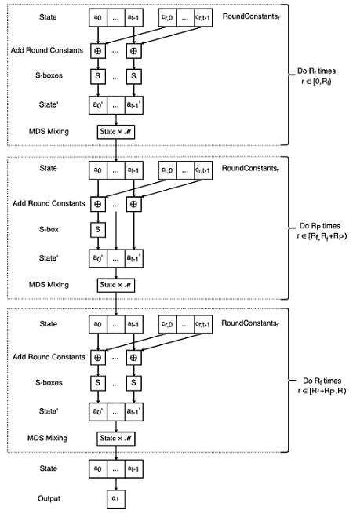
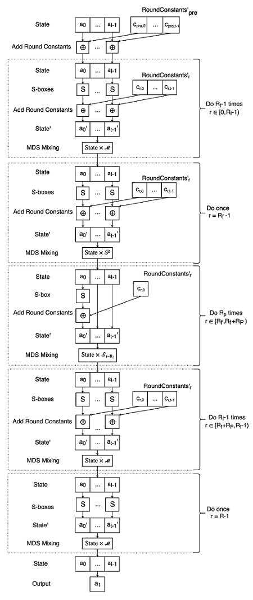
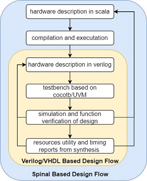
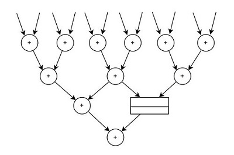
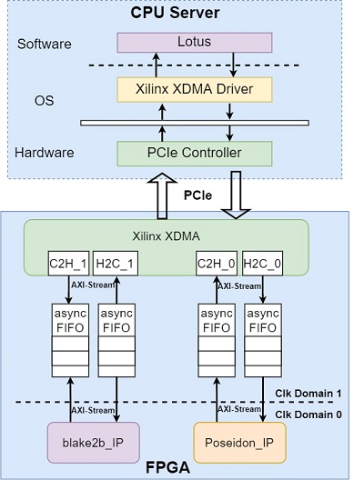
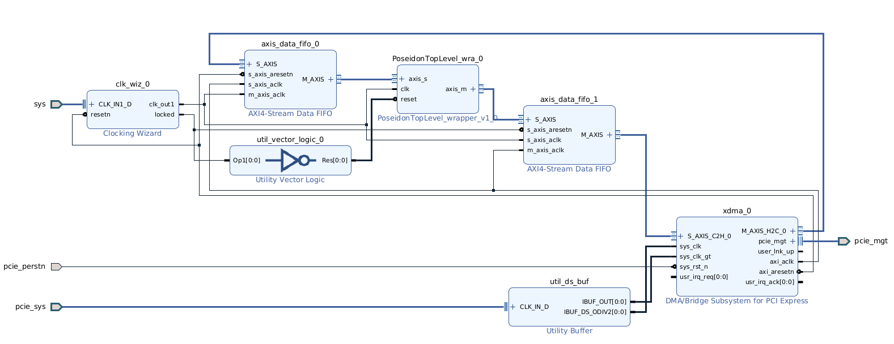
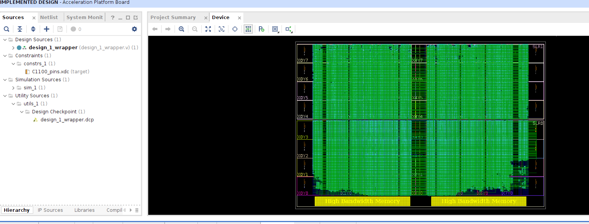
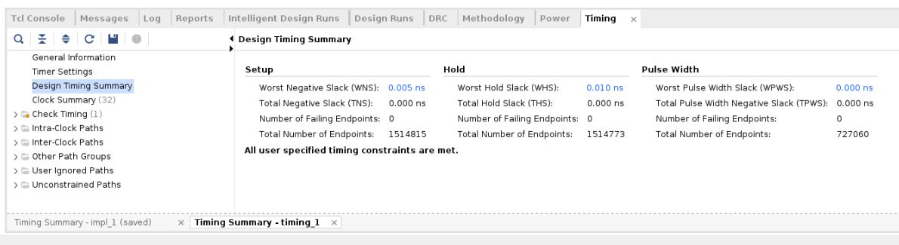
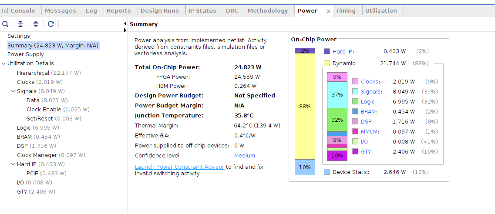

# TRIDENT: A Hardware Implemented Poseidon Hasher

# Introduction:

Poseidon hasher is widely used in blockchain projects such as Filecoin, Mina Protocol, and Dusk Network for their zero-knowledge cryptographic proof, aka ZK-SNARK. This project aims to accelerate ZK-SNARK by implementing the Poseidon hasher on hardware.  To our knowledge, there was no open-source hardware implementation for Poseidon hasher.

Compared to traditional hashers such as SHA256 and SHA3, Poseidon operates directly on finite fields, therefore it is far more efficient when it comes to zero-knowledge proof. TRIDENT implemented the “Filecoin” version of Poseidon which operates on BLS12-381’s scalar field, but it can be modified to use on other elliptic curves as well.

We implemented TRIDENT as a block design in **Vivado Design Suite 2021.2**. The Poseidon hasher is written in [SpinalHDL](https://github.com/SpinalHDL/SpinalHDL), then converted to Verilog, and used as an IP in Vivado. Xilinx [Varium C1100](https://www.xilinx.com/products/accelerators/varium/c1100.html) Blockchain Accelerator Card is used in this project. We use the XDMA PCI-E IP in AXI4-Stream mode to write/read data to/from FPGA. Filecoin’s “Neptune” Rust API is modified to switch Poseidon hashing from on GPU to FPGA. And up to now, TRIDENT has achieved more than two times throughput of CPU implementation and much higher performance-power ratio than GPUs.

In general, TRIDENT provides a complete solution for accelerating Poseidon Hasher in FPGA, including hardware design and software API. Filecoin storage providers can conveniently deploy it in the sealing process of mining, which can improve the efficiency vastly.

The remainder of our project documentation is organized as follows: In Section 1: we will introduce project repository and instructions on the deployment of TRIDENT. In Section 2, we will give a brief introduction to the Poseidon hash function. And for Section 3 and Section 4, we will illustrate details of our implementation including IP design and system construction. And finally, Section 5 shows the detailed performance results of TRIDENT.


# Section 1: Instructions On Deployment

In this section, we will introduce the repository of TRIDENT and how to deploy TRIDENT in the Filecoin application.

## 1.1 TRIDENT Repository

The file directory structure of TRIDENT is shown below:

```bash
.
├── images
│   ├── adderTree.jpg
│   ├── block_design.png
│   ├── device.png
│   ├── opt_poseidon.png
│   ├── poseidon.png
│   ├── spinal.jpg
│   ├── timing.JPG
│   └── whole_arch.jpg
├── LICENSE
├── poseidon-spinal
│   ├── build.sc
│   ├── images
│   │   ├── AdderBasedModAdder.drawio.png
│   │   ├── MDSMatrixAdder.drawio.png
│   │   ├── MDSMatrixMultiplier.drawio.png
│   │   ├── ModMultiplier.drawio.png
│   │   ├── src
│   │   ├── Thread.drawio.png
│   │   └── TopLevel.drawio.png
│   ├── LICENSE
│   ├── poseidon_constants
│   │   ├── mds_matrixs
│   │   ├── mds_matrixs_ff
│   │   ├── round_constants
│   │   └── round_constants_ff
│   ├── README.md
│   ├── run.sh
│   └── src
│       ├── main
│       ├── reference_model
│       └── tests
├── README.md
├── utils
│   ├── lotus
│   │   ├── dma_utils.c
│   │   ├── fpga.cpp
│   │   ├── gpu.rs
│   │   └── Readme.txt
│   └── trident_tester
│       ├── arity_12_inputs.txt
│       ├── arity_12_outputs.txt
│       ├── arity_3_inputs.txt
│       ├── arity_3_outputs.txt
│       ├── arity_9_inputs.txt
│       ├── arity_9_outputs.txt
│       ├── dma_utils.c
│       ├── trident_tester.cpp
│       └── trident_tester.h
└── vivado
    ├── poseidon_ip.tar.gz
    ├── poseidon.tar.gz
    └── trident100MhzC1100.tar.gz
```
There are three main directories in TRIDENT:
- [poseidon-spinal](https://github.com/datenlord/poseidon-spinal.git): design sources of Poseidon accelerator IP
    - build.sc: the configuration of mill, a scala building tool, in which we can set the dependent library of SpinalHDL and some scala compile options;
    - poseidon_constants: includes all constants used in both optimized and unoptimized Poseidon Hasher in *.txt file format;
    - run.sh: the shell script which you can use to generate Verilog codes from SpinalHDL and execute the verification process;
    - src: contains all source codes files of Poseidon accelerator, including hardware design codes in “main”, a reference model of Poseidon in Python in “reference_model” and verification codes in "tests";
  
- utils: software design of TRIDENT
  - lotus:  rust-based software API for lotus to interact with fpga
  - trident_tester: C program to test the performance of TRIDENT
- vivado: vivado projects of TRIDENT based on Vivado 2021.2
  - poseidon_ip.tar.gz:  the vivado custom IP project of Poseidon accelerator
  - poseidon.tar.gz:  the vivado project of the whole TRIDENT system
  - trident100MhzC1100.tar.gz:  bitstream file of TRIDENT which can be directly implemented in Xilinx Varium C1100 card

## 1.2 Deployment

There are mainly three ways to deploy the TRIDENT: 

- Use the .bit file in "vivado" and deploy it in Xilinx Varium C1100 FPGA Card, and then you need to connect the card with PC server through PCIe interface. You can use Xilinx official XDMA driver to interact with FPGA directly and we also provide a C-program in “/utils/trident_tester” that you can refer to. At the same time, we also produce a rust API in “/utils/lotus” which can be used in Lotus to accelerate the sealing process of Filecoin.
- Besides using the .bit file, you can also edit the Vivado project we provide to customize your own FPGA design in the Varium C1100 card. For example, you can replace the PCIe interface with another communication protocol or you can add the existing Poseidon IP into another block design.
- And if you want to deploy TRIDENT in another FPGA platform or you want to modify the design of Poseidon IP, you can also edit our design in SpinalHDL and then generate Verilog codes using “mill” or the script "run.sh" we provide. For example, you can replace AXI4-Stream with AXI-Lite or AXI-full and add Poseidon IP into your SoC design.


# Section 2: A Brief Introduction Of Poseidon

The area of practical computational integrity proof systems, like zk-SNARK, is seeing a very dynamic development with several constructions having appeared recently with improved properties and relaxed setup requirements. Many use cases of such systems involve, often as their most expensive part, proving the knowledge of a preimage under a certain cryptographic hash function, which is expressed as a circuit over a large prime field.

And Poseidon is a new hash function which has been designed to be friendly to zero-knowledge applications, specifically, in minimizing the proof generation time, the proof size, and the verification time. For example, Poseidon hasher is used in the zero-knowledge proof system of FileCoin, an IPFS based decentralized storage network. The computation of Poseidon Hasher involves a large amount of compute-intensive modular multiplications, making it one of the performance bottlenecks in the mining process of FileCoin. Currently, GPU is often used to accelerate the computation process of Poseidon with greater power consumption. And our project, TRIDENT, is attempting to implement Poseidon hasher in FPGA to reach a better performance-power ratio than GPU.

The implementation of TRIDENT is specified for Filecoin’s Poseidon Instantiation, but it can be transformed and applied in other zero-knowledge systems using Poseidon easily. And in the remainder of Section 1, we take Filecoin’s Poseidon Instantiation for example to show the details of the Poseidon hash function.

The Poseidon hash function takes a preimage of (t-1) prime field elements to a single field element. For Filecoin, t can be 3, 5, 9, and 12, which means that the length of preimages can be 2, 4, 8, and 11 and each prime field element is 255-bit. Firstly, the preimage of Poseidon is initiated to the internal state of t prime field elements through domain separation process. And then the internal state is transformed over R (R=RF+RP) rounds of constant addition, S-boxes, and MDS matrix mixing. Once all rounds have been performed, Poseidon outputs the second element of the internal state. The data flow of Poseidon is shown in the picture below:

<div align=center>

</div>

From the picture above, we can find that Poseidon has two kinds of rounds, which are RP partial rounds and RF full rounds. Poseidon calculates half of the full rounds first and then all of partial rounds and finally the remaining half of the full rounds. And the only difference between the two is that: partial rounds only compute the first element of the internal state in SBox stages, but full rounds transform all elements through SBox.

In the round constant addition stage, each prime field element is added by its corresponding round constant, and the constants are different in each round. For Filecoin’s Poseidon instantiation, S-Box computes the fifth power of the state element. And in the MDS Mixing stage, a vector-matrix multiplication is applied in the vector of internal state, where the MDS matrix is t*t and consistent in every round.

In addition to the unoptimized Poseidon hasher shown above, there is also an optimized version of Poseidon Hasher which computes less multiplications in each hash. The data flow picture of optimized Poseidon is shown below. The main advantage of optimized Poseidon hasher over unoptimized one is that the constants matrix of MDS mixing stages in optimized Poseidon is sparse, which averts most of compute-intensive modular multiplications in one vector-matrix multiplication.

<div align=center>

</div>

The data flow of optimized Posieon is shown above. The hash results of optimized and unoptimized Poseidon for the same preimage are consistent. In TRIDENT, we have implemented both kinds of Poseidon hasher in FPGA and the optimized Poseidon can achieve higher throughput but with a more complicated hardware structure. The details of optimized and unoptimized Poseidon, including specific definition and computation of round constants and mds matrices, can be found in the spec of neptune, a rust implementation of Poseidon.

The hardware Implementation of TRIDENT mainly includes two parts: Poseidon IP design and integrated system construction. And we will introduce details of these two parts in Section2 and Section3 respectively:

# Section3: Poseidon IP Design

In Section2, we will introduce the details of the design of the Poseidon accelerator IP. In general, the computation of Poseidon hasher can be perceived as a continuous stream of modular arithmetic operations. So the design of Poseidon IP is about two things: how to implement high performance-area ratio modular arithmetic circuits and then how to organize these arithmetic modules to achieve better utilization and throughput. Additionally, IP design and verification in TRIDENT are implemented through SpinalHDL and Cocotb, which improves the efficiency and quality of our design vastly. So we will first introduce the usage of SpinalHDL and Cocotb in TRIDENT.

## 3.1 Digital Design With [SpinalHDL](https://github.com/SpinalHDL/SpinalHDL) And [Cocotb](https://github.com/cocotb/cocotb)

Spinal is a scala-based HCL(HCL: Hardware Construction Language) or more precisely a scala package featured in alige chip design, which is similar to chisel also based on scala and mostly used in RISC-V CPU design. The process of designing hardware in Spinal can be mainly divided into three steps: 1) use scala and Spinal package to describe the structure and logic of your hardware design; 2) compile and execute the scala program to generate corresponding System Verilog/VHDL codes, which describes the same structure as scala one; 3) using any kinds of simulators such as Iverilog, Verilator or Vivado simulator for hardware simulation and verification. A design flow of SpinalHDL is shown in the picture below:

<div align=center>

</div>

Spinal has various advantages over traditional HDLs and it can ease the design of digital hardware. However, unlike high-level language, it eases and expedites the design process without sacrificing the performance and resources utility of generated hardware. SpinalHDL has almost the same level of precision or granularity of description as traditional HDLs like Verilog or VHDL. It can control the amount of registers and the length of logical path between registers finely. The best proof of approximate description granularity is that: for all RTL-level syntax elements in Verilog/VHDL, SpinalHDL has a counterpart.

Besides the same description level as Verilog, SpinalHDL is more expressive than Verilog. Developers can use abundant advanced language features of scala, like functional programming, object-oriented, and recursion, to describe their hardware design. Taking the realization of the adder tree module used in TRIDENT, we can use the recursion feature in scala to facilitate it. The structure and scala codes of the adder tree are shown below. The adder tree is used in the MDS vector-matrix multiplication, which takes 12 finite field elements as input and outputs the addition result of them. Using recursion, we can easily describe this structure and reuse the code to generate an adder tree with any amount of input elements, which is impossible to realize in Verilog. 

<div align=center>

</div>

```scala
object AdderTreeGenerator{
  def apply(opNum:Int, dataWidth:Int, input:Vec[UInt]):(UInt,Int) = {
    if(opNum == 2) {
      (ModAdderPiped(input(0), input(1)), ModAdderPiped.latency)
    }
    else {
      val adderOutputs = for(i <- 0 until opNum/2) yield
        ModAdderPiped(input(2*i),input(2*i+1))
      if(opNum%2==0){
        val next = Vec(UInt(dataWidth bits),opNum/2)
        next.assignFromBits(adderOutputs.asBits())
        val (nextOutput, latency) = AdderTreeGenerator(opNum/2, dataWidth, next)
        (nextOutput, latency+2)
      } else{
        val next = Vec(UInt(dataWidth bits),opNum/2+1)
        val temp = Delay(input(opNum-1), ModAdderPiped.latency)
        next.assignFromBits(temp.asBits##adderOutputs.asBits())
        val (nextOutput,latency)= AdderTreeGenerator(opNum/2+1, dataWidth, next)
        (nextOutput, latency+2)
      }
    }
  }
}
```

In addition, Spinal has many good encapsulations or abstractions of some classic circuits, like Counter, StateMachine, FIFO, which are frequently used in digital hardware design. Using these abstractions can reduce the workload of designers and the possibility of error during development. The most used circuit in TRIDENT is Stream in SpinalHDL. Stream class implements the handshake protocol in digital design, which includes three signals: valid, ready, and payload. Calling the member methods of Stream class, we can realize different data transfer operations under handshake protocol. For example, we can use the stage() function in the Stream class to implement a Pipeline with backpressure.

Cocotb is a python-based testbench environment for verifying VHDL, Verilog, and SystemVerilog RTL designs. The most important advantage of Cocotb is that: Python is far more productive, expressive and succinct than traditional languages used for verification like Verilog, VHDL, and System Verilog. At the same time, we can build a reference model more quickly and conveniently based on python’s abundant package and community. For example, In TRIDENT, we also implement Poseidon haser in python, which is used as the golden model for verification. One of the difficulties in realizing it in software is that variables in Poseidon hasher are 255-bit and are usually unsupported in other program languages. But python can realize computations of Integers with any width, which facilitates the implementation greatly.And it's worth noting that codes in TRIDENT that have passed testbenches of Cocotb can work on FPGA correctly and stably without additional hardware debugging process using debugging tools of Vivado, such as ILA.

Besides the points we mentioned above, SpinalHDL and Cocotb still have a lot of advantages over traditional HDL in digital design and verification, which we believe will simplify FPGA design and promote the application of FPGA in many fields. But currently, SpinalHDL and Cocotb haven’t been fully supported by Vivado, for example, we can’t run cocotb testbench in Vivado simulator and it’s also troublesome to instantiate Xilinx IP in SpinalHDL. So we hope that Vivado and other Xilinx design tools can better support SpinalHDL and Cocotb in the future. 

## 3.2 Modular Arithmetic Operator
The detailed hardware design of arithmetic operators in TRIDENT is introduced in poseidon-spinal.

## 3.3 Accelerator Architecture
The details of Poseidon IP's architecture are introduced in poseidon-spinal.

# Section4: FPGA System Design

The overall architecture block diagram of the TRIDENT system in the project is shown in the figure below. In the CPU part, TRIDENT provides a rust API for lotus, a popular Filecoin node implementation, to send to and receive data from FPGA and the API is adapted from the Xilinx XDMA driver. And the FPGA hardware part is mainly composed of three modules: Xilinx XDMA IP, asynchronous FIFO, Poseidon accelerator IP; Among them, XDMA provides a unified PCIe interface for the upper CPU Server, and provides a unified AXI-Stream interface for the hardware design in FPGA. The working frequency of xdma IP, 250MHz, is higher than the frequency of Poseidon IP ranging from 100MHz to 200MHz. So asynchronous FIFO is in charge of cross-clock domain data transfer from XDMA to the accelerator. And finally, the Poseidon accelerator IP with standard AXI4-Stream interface is the computation core of the hardware system and is responsible for the acceleration of Hash functions.

<div align=center>

</div>

We implement the whole FPGA hardware system design through the Block design tool in Vivado.The block design diagram which shows the connections between different modules is as below:

<div align=center>

</div>


# Section5: Implementation And Performance

## 5.1 Implementation Results:

The implementation result and performance of TRIDENT are shown in this Section. After implementation, the FPGA hardware resource utilization is shown in the table below. The shortage of DSP slices and LUTs used in modular multipliers is the main bottleneck in the design to achieve better performance.

|  | Usage | Total | Percentage |
| --- | --- | --- | --- |
| CLB LUT | 533050 | 871680 | 61.15% |
| CLB Registers | 835492 | 1743360 | 47.92% |
| LUT as Memory | 87548 | 403200 | 21.71% |
| Block Ram Tile | 61.5 | 1344 | 5% |
| DSP slices | 4108 | 5952 | 70.01% |
| Carry8 | 54657 | 108960 | 50.16% |
| F7 Muxes | 1213 | 435840 | 0.2% |
| F8 Muxes | 37 | 217920 | 0.01% |

**Implementation Results:** 



**Timing Information:** 
The working frequency of Poseidon IP is set at 100MHz and the timing report of Vivado implementation is shown below. The current design is just enough to meet the target frequency. And this frequency is still below our expectation of 250MHz, which is the output frequency of XDMA IP. In order to get a higher throughput, we will continue to improve it by cutting the critical path in our design.



## 5.2 Performance Of TRIDENT

In TRIDENT, two ways have been used to measure the performance of the whole system.

The first one: we write a C program, which directly sends preimages to and receives hash results from FPGA, and calculates the whole duration time from sending the first preimage to the reception of the last hash result. The exact performance of TRIDENT in three kinds of length preimages is shown in the table below. For arity2, TRIDENT finish 850000 hashes in 0.877s and its data transfer rate can reach 29.1651 MB/s, which means in one second it can finish the computation of approximately 1M hashes.

|  | preimage num | hash duration(s) | transfer rate(MB/s) | hash rate(hash/s) |
| --- | --- | --- | --- | --- |
| arity 2 | 850000 | 0.877 | 29.1651 MB/s | 0.991 Mhash/s |
| arity 8 | 250000 | 0.697 s | 11.4776 MB/s | 358 Khash/s |
| arity 11 | 100000 | 0.328 s | 9.75053 MB/s | 305 Khash/s |

The second one: as we mention above, TRIDENT also provides a Rust-based software API for Lotus, a Filecoin node implementation, so that Lotus can employ the FPGA to accelerate the sealing process as the usage of GPU. And in Lotus, there is a specific benchmark program, lotus-bench, which can measure the performance of different computation processes in Filecoin mining precisely. And we use lotus-bench to test the performance of GPU, CPU, and TRIDENT in the sealing process which needs Poseidon hashers respectively. The result is shown in the table below:

|  | Model | Sector Size | Duration | Transfer Rate  |
| --- | --- | --- | --- | --- |
| GPU | Nvidia RTX 3070 | 512 MiB | 10.855 s | 47.17 MiB/s |
| CPU | AMD Ryzen 5900 | 512 MiB | 40.723 s | 7.41 MiB/s |
| TRIDENT | Xilinx Varium C1100 | 512 MiB | 32.713 | 15.65 MiB/s |

In the performance results above, we can see that TRIDENT‘s hash rate can achieve more than two times of CPU’s rate but still fall behind GPU‘s hash speed. But given the great power consumption of GPU, TRIDENT can still have a better performance-power ratio. And the power consumption of TRIDENT is shown in the picture below: 



We can see that the total On-chip power of FPGA is 24.823W and the maximum power consumption in the specification of RTX 3070 revealed on Nvidia’s official website is 220W. It’s obvious that FPGA is much more efficient than GPU in terms of performance-power ratio.

Although TRIDENT is currently weaker than GPU in performance, we have seen a lot of room for improvement. And we perceive that the improvement mainly comes from three aspects: 
1) optimizing the timing of the current design to reach a higher frequency; 
2) innovating the structure of the arithmetic modules to achieve a better performance-area ratio;
3) modifying the architecture of the accelerator IP and the whole FPGA system to improve the utilization of arithmetic modules. 
